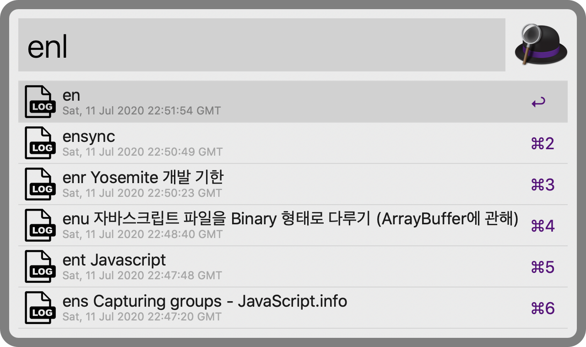

<h1 align="center">
  <a href="https://img.shields.io/npm/dw/alfred-evernote-workflow">
		Alfred-evernote-workflow<br>
	  
  </a>
</h1>

[](https://nodei.co/npm/alfred-evernote-workflow/)

Evernote workflow for Alfred 4

* *Fast search using [Evernote sdk](https://github.com/evernote/evernote-sdk-js)*
* *Preview feature using caching.*
* *You can change your search details.*

<p align="center">

</p>

## 📋 Features

* *View your latest notes*

<p align="center">

</p>

* *Search evernote with keyword*

<p align="center">

</p>

* *Search evernote with `Advanced Search Syntax`*

<p align="center">

</p>

<p align="center">

</p>

* *View your all tags*

<p align="center">

</p>

* *Search your tag*

<p align="center">

</p>

* *View and execute your usage log*

<p align="center">

</p>

* *Preview your note in alfred*

<p align="center">

</p>

Alfred-evernote-workflow caches note content and resources from the Evernote client and uses them for previews.

In Preview, you can view the contents and images of your notes.


## 📌 Prerequisite

The prerequisites below are required to use that package.

* Evernote Client on macOS (None App-store version)

* Node JS

* [Alfred powerpack](https://www.alfredapp.com/powerpack/)

Note that your Evernote Client shouln't be App store version. (downloaded from the App Store)

If you're not sure your Evernote Client version, I'm recommending reinstall Evernote by below version to use this plugin.

[Evernote client Download](https://evernote.com/intl/en/download)

And don't forget to login into Evernote client and sync should be completed.

##  🔨 How to install

1. **Install package by npm**

```
$ npm install --global alfred-evernote-workflow
```

If you have problem with installation with above command,

Please refer [these installaion issues](https://github.com/jopemachine/alfred-evernote-workflow/issues/8).

And let me know if the problem still remains or if there are other issues.

2. **`en > gettoken` + <kbd>Enter</kbd>  to get your API key**

Type `en > gettoken` and get your OAuth key.

When you log in to the site and press the authentication button, `oauthToken` is printed in json format.

Pass the value as a argument in the authoken command.

3. **`en > authtoken {your issued API key}` + <kbd>Enter</kbd>**

Alfred-evernote-workflow use your token to authenticate your account.

4. **`en > savecache` + <kbd>Enter</kbd>**

If you want to not use preview feature, you can skip this phase.

5. **Done!**

## 📗 How to use

In Alfred, type below query and <kbd>Enter</kbd>

You can use below feature.

### en

Switch to Evernote App.

### en > authtoken { Argument }

Argument: {`Your api key`}

This command is required only for the initial authentication process.

This command save the token value obtained from gettoken to a file.

### en > gettoken

This command is required only for the initial authentication process.

The command opens Chrome to the Evernote site.

When you log in to the site and press the authentication button, `oauthToken` is printed in json format.

Pass the value as a argument in the authoken command.

### en > help

Open Github link to view README.md.

### en > sync

Sync Evernote Client.

### en > savecache

Alfred-evernote-workflow use html cache to enable note preview feature.

This command save html caches of all of notes from your Evernote client. 

When the command is running, you are not able to run note searches with the `ens` command.

In this case, the `ens` command displays the number of notes that are cached to show you progress.

If caching is not done properly for some reason, you can use `en > clearcache` and this command to perform initial caching.

After initial caching, the cache will be updated automatically.

### en > clearcache

Delete all of your html caches.

If you delete all the cache and use the `ens`, you are likely to be caught in the sdk's api call limit.

### en > clearlog

Clean all command logs

### entodo

Search only for notes that have check boxes.

### encl 

Adds the text from the clipboard to the Evernote as a new note. 

### enclo

Adds the text from the clipboard to the Evernote as a new note and Open the note. 

### enc { Argument }

Argument: {`note content`}

Create note by text.

### enct

Argument: {`note title to create`}

Search tag name and create note by the selected tag and note content if you want.

### enu { Argument }

Argument: {`url to search with`}

If no argument exist, search for all notes with source URL.

Search Notes by url.

### ens { Argument }

Argument: {`content to search`}

Search the Evernote's notes.

If no argument exist, search for the most recent notes (may vary depending on options)

To change the search option, see the topic *Options.*

* #### *Shift key* + <kbd>Enter</kbd>

You can invoke the Quicklook by pressing the shift key for the `ens` search results.

Quicklook displays the note in html format.

* #### *Fn key* + <kbd>Enter</kbd>

You can view the source URL for that note by pressing the Fn key for the search results in theens.

And you can open the source URL by chrome by entering the item.

If the note does not contain a sourceURL, you will receive an error notification.

### enn { Argument }

Argument: {`content to search`}

Search the Evernote's notes in your Trash bin.

Note that the enter action for this command is to open the cache of the note in the Chrome browser.

(Not your Evernote client)


### ent { Argument }

Argument: {`tag name`}

Search Evernote's tag. You can filter notes by entering on that tag.

If no argument exist, search for all tags.

If you select the tag, the notes with the tag will be searched.

You can search these notes just like the `ens` command.

* #### *Command key* + <kbd>Enter</kbd>

By pressing the command key and pressing the entry, you can open the window for notes with that tag.

### enr { Argument }

Argument: {`content to search`}

Search only for notes that have reminder.

### enb { Argument }

Argument: {`notebook name`}

Search notes by Notebook.

If you select the notebook, the notes in that notebook will be searched.

If no argument exist, search for all notebooks.

You can search these notes again.

### enf { Argument }

1st Argument: {`file extension`}

2nd Argument: {`content to search`}

Search for notes with attachments of a specific extension.

Example:

```
// Search for pdf files with compiler in file name
enf pdf compiler
```

### enl

Check your command usage log.

By selecting the corresponding log, you can execute the command.

The maximum number of logs to be stored can be specified in Options.

This command displays the same command only once.

enl supported commands : `ens`, `ent`, `enf`, `enr`, `enb`, `enu`, `noteopen`, `en > sync`, `entodo`

### enx { Argument }

Argument: {`content to search`}

Export the retrieved note to your Desktop path as html.


## 🔖 Search Options

You can change various option by changing value of `searchConfig.json`

<hr>

* **search_max_count**

Type: `number`

Determines how many items you want to search for with `ens` command.

<hr>

* **search_subtitle**

Type: `string (enum)`

| Possible Value | Desc |
|:----:|:----:|
| "tags" |  In the search results subtitle, specify the tags that contain the note. |
| "created_time" | In the search results subtitle, specify the date when the note was created. |
| "last_edited_time" |  In the search results subtitle, specify the date when the note was updated.  |
| "content_length" |  In the search results subtitle, specify the length of the note |
| "notebook" |   In the search results subtitle, specify the notebook name of note |

In the `ens` search results subtitle, specify which item Alfred show.

Note that some items may increase the api call of sdk, resulting in more sdk limit restrictions.

<hr>

* **search_order**

Type: `string (enum)`

| Possible Value | Desc |
|:----:|:----:|
| "created" | Search notes in the order in which they were created. |
| "updated" | Search notes in the order in which they were updated. |
| "relevance" | Search notes in the order in their relevance. |
| "title" | Search notes in the order in their title. |

<hr>

* **search_include_options**

Type: `object`

Specifies the items to include in the `ens` search results.

if you're sure that some attribute is useless in your search, you can optimize your search by excluding the attribute (by setting the value false).

<hr>

* **tag_search_subtitle**

Type: `string (enum)`

| Possible Value | Desc |
|:----:|:----:|
| "none" | none |
| "parent_tag" | In the search results subtitle, specify parent's tag of the tag |
| "note_count" |  In the search results subtitle, specify number of notes that the tag has |

In the `ent` search results subtitle, specify which item Alfred show.

Note that some items may increase the api call of sdk, resulting in more sdk limit restrictions.

<hr>

* **cliped_note_tag**

Type: `string`

Tag notes that you clip with the `encl`, `enclo` command with that name.

<hr>

* **subtitle_restrictor**

Type: `number`

To refrain from frequent occurrence of Evernote sdk's api rate, subtitle api calls are restricted above a certain number.

`tags`,`notebook` are affected by this value.

(Other values always displays subtitle)

<hr>

* **cache_save_count**

Type: `number`

Determine how many logs you want to save and display in `enl` command.

Duplicate commands are displayed only once.

<hr>

* **create_and_open**

Type: `boolean`

When you use the `enc`, `enct` command, you can decide if you want to open the note after creating it.

<hr>

* **using_preview**

Type: `boolean`

You can turn off caching feature by set this value false.

If this value is false, the html cache is not downloaded or updated.

The html cache is stored in search_content path.

Use the `en > clearcache` command to remove the cache already downloaded.

## License

MIT © [jopemachine](https://github.com/jopemachine/alfred-evernote-workflow)

