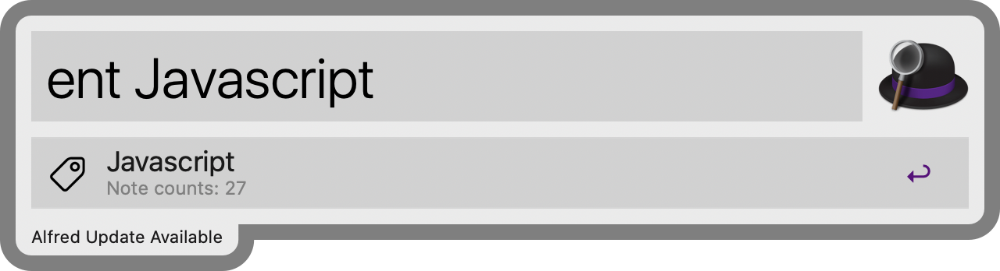

# Alfred-evernote-workflow

Evernote workflow for Alfred 4

## Feature

* *View your latest notes*

<p align="center">

</p>

* *Search evernote with keyword*

<p align="center">

</p>

* *Search evernote with `Advanced Search Syntax`*

<p align="center">

</p>

<p align="center">

</p>

* *View your all tags*

<p align="center">

</p>

* *Search your tag*

<p align="center">

</p>

* *View and execute your usage log*

<p align="center">

</p>

## How to install

1. **Install package**

```
$ npm install --global alfred-evernote-workflow
```

*You need to [Node.js](https://nodejs.org) 4+ and the Alfred [Powerpack](https://www.alfredapp.com/powerpack/) to use this package*

2. **Type `en > login`  to get your API key**

Type `en > login` and get your OAuth key.
(Evernote use OAuth 1.0)

*You need to your Evernote account to proceed with the above*.

3. **Type `en > auth 'your issued API key'`**

Alfred-evernote-workflow use your token to authenticate your account.


4. **Done!**

## How to use

In Alfred, type below query and <kbd>Enter</kbd>

You can use below feature.

|  Keyword  | Argument |   Desc   |
|:----:|:----:|:----:|
|  `en`  | No argument |   Switch to Evernote App.   |
|  `en > login`  |  No argument  |    This command is required only for the initial authentication process.    |
|  `en > auth`  | { your api key } |    This command is required only for the initial authentication process.    |
|  `en > help`  |  No argument  |    Open Github link to view README.md    |
|  `ensync`  |   No argument   |    Sync Evernote.    |
|  `entodo`  |   No argument   |    Search for notes with check boxes.    |
|  `encl`  |   No argument   |    Adds the text from the current clipboard to the Evernote as a new note.    |
|  `enclo`  |   No argument   |    Adds the text from the current clipboard to the Evernote as a new note and Open the note.    |
|  `enc`  | { Note content } |    Create note by text    |
|  `enct`  | { note title to create } | Search tag name and create note by the selected tag and note content if you want |
|  `enu`  | { url } |    Search Notes by url    |
|  `ens`  | { content to search } |    Search the Evernote's notes.    |
|  `ent`  | { tag name } |    Search Evernote's tag. You can filter notes by entering on that tag.    |
|  `enr`  | { tag name } |    Search notes with reminder    |
|  `enb`  | { notebook name } |    Search notes by Notebook    |
|  `enl`  |  No argument  |    Check your command usage log    |

## Options

You can change various option, including search options by changing value of `config.json`

<hr>

* **search_max_count**

| Possible Value | Desc |
|:----:|:----:|
| "search_max_count" | {number} |

Determines how many items you want to search for in the `ens` command.

<hr>

* **search_subtitle**

| Possible Value | Desc |
|:----:|:----:|
| "tags" |  In the search results subtitle, specify the tags that contain the note. |
| "created_time" | In the search results subtitle, specify the date when the note was created. |
| "last_edited_time" |  In the search results subtitle, specify the date when the note was updated.  |
| "content_length" |  In the search results subtitle, specify the length of the note |
| "notebook" |   In the search results subtitle, specify the notebook name of note |

In the `ens` search results subtitle, specify which item Alfred show.

<hr>

* **search_order**

| Possible Value | Desc |
|:----:|:----:|
| "created" | Search notes in the order in which they were created. |
| "updated" | Search notes in the order in which they were updated. |
| "relevance" | Search notes in the order in their relevance. |
| "title" | Search notes in the order in their title. |

<hr>

* **tag_search_subtitle**

| Possible Value | Desc |
|:----:|:----:|
| "none" | none |
| "parent_tag" | In the search results subtitle, specify parent's tag of the tag |
| "note_count" |  In the search results subtitle, specify number of notes that the tag has |

In the `ent` search results subtitle, specify which item Alfred show.

<hr>

* **search_include_options**

Specifies the items to include in the `ens` search results.

if you're sure that some attribute is useless in your search, you can optimize your search by excluding the attribute (by setting the value false).

<hr>

* **cliped_note_tag**

Tag notes that you clip with the `encl`, `enclo` command with that name.

<hr>

* **subtitle_restrictor**

To refrain from frequent occurrence of Evernote sdk's api rate, subtitle api calls are restricted above a certain number.


* **cache_save_count**

Determine how many logs you want to save and display in `enl` command.

## License

MIT © [jopemachine](https://github.com/jopemachine/Alfred-evernote-workflow)
